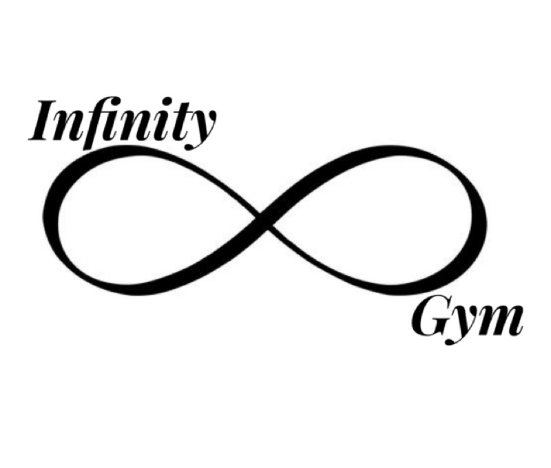

To run a frontend (HTML, CSS, Javascript only) application in Gitpod, in the terminal, type:

Python3 -m http.server

## Purpose
Infinity Gym is a gym and fitness center, this gym is open for about two months and is located in Almere Poort about 20 minutes from Amsterdam. The gym has four rooms, two empty rooms for group lessons, a spinning room and an extensive fitness room.
The guests can therefore enjoy a good workout and / or (group) lessons here.

## UX

## User Story
Infinity Gym would like to increase its customer base through a free first month promotion 

User’s goal:

* As a user, I want to know what classes there are and what times. 
* As a user, I want to be able to locate the gym
* As a user, I want to be able contact the gym

* As a user, I can view the classes timetable so that I can plan my workout routine around my favorite classes.
* As a user, I want to view the gym’s contact information so that I can ask about the membership or when the quietest times are.

Site owner’s Goal:
* As the site owner, I want to be able to inform visitors of the class timetables
* As the site owner, I want to be able to inform visitors the location of the gym

## Features

Navigation: The navigation link styled simple and clear.

Lessons: On this page u find all the information of the lessons that will be given during the week.

Timetable: For the timetable I created a simple table using a timetable from [W3schools](https://www.w3schools.com)this allows users to find the classes, times and locations of the rooms.

## Technologies Used

•	Github
•	Gitpod
•	Bootstrap

* For the "Call Us" Button i used css-tricks

* For the Quotes i used w3school

* The logo i made myself

* The rest off the pictures i got from pexels.com

•	for the timetable i used w3school

## Tools used

•	[Balsamiq] I used balsamiq to create my wireframes

* [Adobe Color]

## Testing

## Deployment

## Credits

Content
The text for section Y was copied from the Wikipedia article Z
Media
The photos used in this site were obtained from ...
Acknowledgements

## typography

