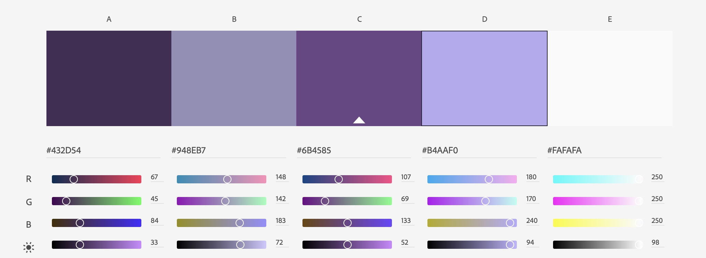
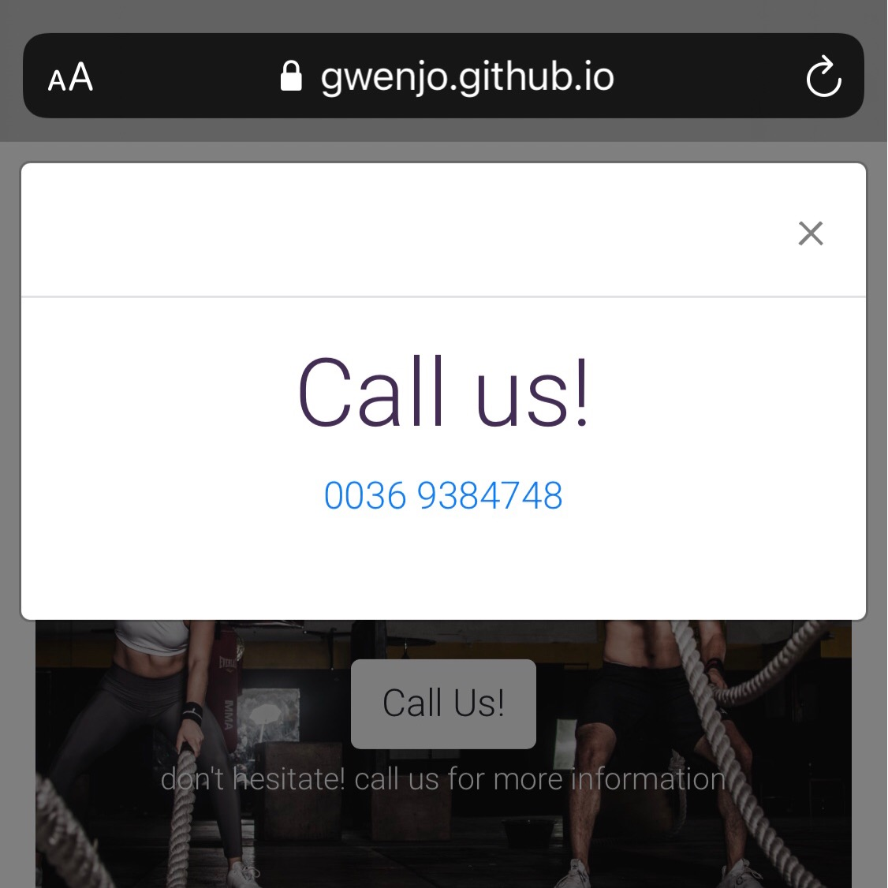

## Welcome to Infintiy Gym
---
[live version of Infinity Gym](https://gwenjo.github.io/MS1-infinity-gym/) 

Infinity Gym is a fictional gym. I set this up gym for my MS1 project

The Infinity Gym site and his content has been created to increase the customer base.
Infinity Gym is a gym and fitness center, this gym is open for about two months. The gym is located in Almere Poort 
about 20 minutes from Amsterdam (The Netherlands). The gym has four rooms, two empty rooms for group lessons, 
a spinning room and an extensive fitness room. The guests can therefore enjoy a good workout and / or (group) lessons here.

## User Experience (UX)
---

Infinity Gym would like to increase its customer base through a free first month promotion.
User Story

User’s goal:
* As a user, I want to know what lessons there are available in the gym.
* As a user, I want to know the class timetable so that I can plan my workout routine around my favorite lesson.
* As a user, I want to view the gym’s contact information so that I can ask about the membership.
* As a user, I want to be able to locate the gym.

Site owner’s Goal:
* As the site owner, I want the user to have an easily accessible site.
* As the site owner, I want to be able to inform visitors of the class timetables.
* As the site owner, I want to be able to inform visitors the location of the gym.

## Wireframes   
---
With the user stories I used [Balsamiq] (https://balsamiq.com/) to create a nice and simple layout for the desktop and mobile screen.

The wireframes: 
    - Home/ about page
    - Lessons page
    - Timetable page
    - Locations page can be viewed [here](assets/documents/wireframes.pdf)

## Setup

When I started on this project I already knew what I wanted. A simple website where everything is clear.

Since I wanted to do everything perfectly in my head, I started over more than three times.
I've been working on multiple screens and got confused and forgot to save the pages in "git add". So, I couldn't save it after a while.

After talking to my mentor, she told me I only committed 11 times. This was not my intention, but my own mistake. 
I was able to restore my gitpod after saving everything, then clearing all .html pages, then committed + pushing everything, then 
creating new .html pages. 

That way I could record everything again. Therefore, there is probably not enough committed pages.

## Features
---
###### Navigationbar:
Each page has a navigation bar that contains all links to every page on the website. The - Lessons, - Timetable and - Location page. 
This is located at the top right of the page. Users can easily navigate through this. On the upper left side u will find the name of the gym

###### Header:
All pages contain the logo of the gym and a "Call us" button, which displays the gym's number when you click on it.

###### Footer:
Each page also has a footer with contact details, opening times, a download button where users can download and / or print the timetable, 
and three social media links that give all users access to our social media platforms on a separate page.

#### Existing Features

###### Home-Page:
The "about" is a brief introduction of the gym and where is located.
Below the about section there are two reviews that are displayed by guests (with their pictures) who are new to the gym and want to share 
their experiences with new users.

###### Lessons-Page:
On this page you will find information about the lessons within Infinity Gym. Under the information of the lessons there is a button that 
refers to the timetable.

###### Timetable-Page:
A simple and clear timetable has been created where the user can easily find his or her class. The timetable provides a weekly timetable 
with information about the times and locations where classes are conducted. It is also indicated how many people can participate in the 
lesson due to Covid-19.

###### Location-Page:
The location page is easy to find via the main navigation. On this page you will find the address and a small map of the location.

#### Features Left to Implement

For the future of the website it would be easy to create a contact form. Interested parties 
can then leave their e-mail address and the customer list can be expanded on this basis.

## Technologies Used
---

* Github
* Gitpod
* HTML5 
* CSS3
* Bootstrap 4

### Tools used
---

**[Balsamiq](https://balsamiq.com/)**
-   Before I started the website I used the Balsamiq software to set up my wireframe.  
During this process I modified the website several times and it doesn't look quite the same as the wireframes.

**[PicCollage](https://piccollage.com/)**
-   I made the logo myself. For the Logo I have used an app on my Iphone. So that I could type the name 
(Infinity Gym) and easily could crop my logo.

**[Pexels](https://pexels.com/)**
-   I've used photos from photographers who posted photos on pexels.

**[Adobe Color](https://color.adobe.com/nl/create/color-wheel)**
-   For the font-color I used Adobe Color. [Click here](assets/documents/adobe-color.jpg)

**[W3School](https://www.w3schools.com/) + [Bootstrap](https://getbootstrap.com/)**
-   The first schedule I made was from W3School. but I didn't like the outcome of the table. 
    Then I continued my search and found one on Bootstrap.
-   For the Quotes I used blockquotes from W3School.

**[Css Beautifier](https://www.freeformatter.com/css-beautifier.html)**
-   I used this online tool to beautify/format my CSS code.

**[Am I Responsive Design](http://ami.responsivedesign.is)**
-   For my mockup in my readme file i used Am I Responsive Design.

**[CSS Tricks](https://css-tricks.com/)**
-   For the button "Call us" I used the "model" code of css-tricks, I changed this to a only "call us" pop-up. 
    The only information you will find in this pop-up is the telephone number of Infinity Gym.

**[Auto-Prefixer](https://autoprefixer.github.io)**
-   I used auto-prefixer to make sure my CSS works on all modern browsers.

**[W3C HTMl Validator](https://validator.w3.org/)**
-   I used this tool to validate my HTML code.

**[W3C CSS Validator](http://jigsaw.w3.org/css-validator/)**
-    I used this tool to validate my CSS code.

**[Dillinger](https://dillinger.io/)**
-   i used dillenger for my readme file.

### Typography + Color
---

For the typography I have used Roboto with a backup font of Sans-serif. It is a simple and easy to read font.
The font is also easy to read on smaller devices.

I used adobe color scheme for choosing the colors of my website.

Body text: #432d54

Title of the gym  #948eb7

Btn hover #purple

## Testing
---
#### W3C URL Validator
When I first passed my site through the validation, it revealed 3 errors, 

1.	I changed a < p > to a < h6 >
2.	I changed the btn names on all pages.
3.	I changed the header and put it in the right place.

After correcting it I ran it through the validator again and it came back without errors.

#### W3C HTML Validator
The following pages were passed through the W3C HTML validator:
*   index.html
*   lessons.html
*   timetable.html
*   location.html

Some minor errors were found. Such as closing} and too many spaces between code. This has been 
corrected and passed through the W3C CSS validator again. The page passed without errors or warnings.

#### W3C CSS Validator

The following pages were passed through the W3C CSS validator:

*   style.css

Some minor errors were found. Such as closing} and too many spaces between code. This has been corrected 
and passed through the W3C CSS validator again. The page passed without errors or warnings.

User Stories

User’s goal:

**As a user, I want to know what lessons available in the gym**

*   On a desktop, a simple navigation bar is displayed in the top right corner of the corner page. The "Lessons" item provides users with information about all the classes taught at Infinity Gym.

*   If you are interested in one of the lessons, there is a button at the bottom of the explanation that refers to the “Timetable”.
*   On a mobile device, you will see a drop-down menu with the options "Lessons". 

**As a user, I want to know the class timetable so that I can plan my workout routine around my favorite lesson.**
*   On a desktop, a simple navigation bar is displayed in the top right corner of the corner page. The "Timetable" item provides users with information about a weekly timetable. 

*   he class schedule from Monday to Sunday is displayed on the schedule page. It is easily accessible from the navigation bar.
*   If you are interested in one of the lessons from the timetable, there is a button at the bottom of the timetable that refers to the “Lessons”.
*   On a mobile device, you will see a drop-down menu with the options " Timetable”.

**As a user, I want to be able to locate the gym.**
*   On a desktop, a simple navigation bar is displayed in the top right corner of the corner page. The "Location" item provides users with information about the location.
*   The address and a picture of “Google maps” will show the location of Infinity Gym. 
*   On a mobile device you will see a dropdown box with the options “Location”.

**As a user, I want to view the gym’s contact information so that I can ask about the membership.**
*   On a desktop, you can press the "Call us" button when opening the website. A pop-up will open with the phone number of Infinity Gym.
*   On the navigation bar in the top right corner of the corner page, the user will find the item “Location” which gives the user the contact details of the gym.

Site owner’s Goal:

**As the site owner, I want the user to have an easily accessible site.**
*   The user can easily move around the navigation bar and see the menu items.
*   The user can easily navigate through the site and you will be easily redirected to the respective page.

**As the site owner, I want to be able to inform visitors of the class timetables.**
*   The user can find a simple and clear timetable (Monday-Sunday) on the timetable page.
*   The user can easily download the timetable in the footer of the page.

**As the site owner, I want to be able to inform visitors the location of the gym.**
*   The user can easily navigate to the location page.
*   The user can easily move around the index / about page and see the "Call us" button.

#### Further testing
The website has been tested on multiple browsers such as:
-	Google Chrome	     
-	Safari (IOS)		
-   Internet Explorer
-   Mozilla Firefox

The website has also been tested on various devices such as:
-	Desktop
-	Laptop
-	And various cell phones

All pages and navigation links work properly and have been checked.
-   Home/ About
-   Lessons
-   Timetable
-   Location

**Home Page**

*Navigation Bar:*
1.	Go to the Home page on a desktop, you will find the name of the Gym at the top left. When you click on this, it will always take you back to the homepage.
2.	You will see the navigation bar on the right. When you resize the screen to a smaller size, the menu will automatically adjust to a dropdown icon. When you click on it, the menu it opens as a dropdown. 
3.	All links from the navigation to the correct pages have been checked and work properly.
*   Logo name > Homepage 
*   Home > Home page 
*   Lessons 
*   Timetable 
*   Location 

*Message:*
1.	When opening the website on a desktop you will first see a large photo in the background with the message stating that the first month is free.
2.	If you scroll down, the jumbotron background image will stay and the text will scroll over the photo.
3.	If I resize the screen to an iPad or iPhone the jumbotron background image does not work. On Stack overflow I’ve read that the jumbotron does not (yet) work on small devices. what I did is resize the jumbotron background. So that you can read the message on smaller devices.
4.	Below the message is an A "Call us" button. Hover over the “Call us” button, you will see the color change.
5.	When u click on the call us button on a desktop a pop-up will appear with the number where infinity Gym can be reached. (This button is repeated on every page.) 
6.	On a mobile device a pop-up will appear with the number, when clicking on the phone number you immediately get the option to call the number. 
7.  The user can control all actions related to pop-ups.

*About:*
1.	Below the message is a small introduction about the gym and a link that refers you to the lessons that are given at Infinity Gym. Hover over the lesson button the color will change. 
2.	Click on the button and it will direct you to the correct “lessons” page. The link works and takes you to the lessons page. 
	
*Footer:* 
1.	In the footer you will find the contact, it contains the opening hours and telephone number of the gym.
2.	On a mobile when clicking on the phone number, you immediately get the option to call the number. The user can control all actions related to pop-ups 
3.	In the middle of the footer there is a download link of the timetable.
4.	When you click on the link, another page opens with the timetable so that you can download and / or print it. The link works and opens another page to the timetable. 
5.	If you hover over the social media icons, you will see that it changes purple in color.
6.	Click on each social media icon to check if each icon opens on its own page.
•	Facebook, Instagram, Twitter these links all work and they will open on separate pages.

**Lessons Page**

*Navigation Bar:*

The navigation bar will be the same as the home page. Everything works as it should.

1.	When opening the lessons page on a desktop you will large photo in the background with the title Lessons.
2.	If you scroll down, the jumbotron background image will stay and the text will scroll over the photo.
3.	If I resize the screen to an iPad or iPhone the jumbotron background image does not work. On Stack overflow I’ve read that the jumbotron does not (yet) work on small devices. what I did is resize the jumbotron background. You will see the photo will move when you scroll down the page.
4.	Below the photo you will find a short intro about the lessons.
5.	Below the intro is the "Call us" button which can also be found on the home page, this is easy for the user to find the number. The user can control all actions related to pop-ups

*Lessons:*
1.	Information is provided on the different lessons available at Infinity Gym.
2.  The photos I used for this website have the correct style and color and have not been stretched or squashed.
3.	Below the information of the lesson there will be button that refers you to the Timetable.
4.	Hover over the timetable button the color will change. 
5.	Click on the button and it will direct you to the “timetable” page. The link works and takes you to the timetable page. 

*Footer:*

The footer information will be the same as the homepage. These have all been tested individually on each page.

**Timetable Page**

*Navigation Bar:*

The navigation bar will be the same as the home page. Everything works as it should.

1.	When opening the timetable page on a desktop you will large photo in the background with the title Timetable.
2.	If you scroll down, the jumbotron background image will stay and the text will scroll over the photo.
3.	If I resize the screen to an iPad or iPhone the jumbotron background image does not work. On Stack overflow I’ve read that the jumbotron does not (yet) work on small devices. what I did is resize the jumbotron background. You will see the photo will move when you scroll down the page.

*Timetable:*
1.	A timetable from Monday to Sunday is shown on this page.
2.	Below the timetable there will be button that refers you to the Lessons.
3.	Hover over the lesson button the color will change. 
4.	Click on the button and it will direct you to the “lessons” page. The link works and takes you to the lessons page. 

*Footer:*

The footer information will be the same as the homepage. These have all been tested individually on each page and all work.

**Location Page**

*Navigation Bar:*

The navigation bar will be the same as the home page. Everything works as it should.

1.	When opening the location page on a desktop you will large photo in the background with the title Location.
4.	If you scroll down, the jumbotron background image will stay and the text will scroll over the photo.
5.	If I resize the screen to an iPad or iPhone the jumbotron background image does not work. On Stack overflow I’ve read that the jumbotron does not (yet) work on small devices. what I did is resize the jumbotron background. You will see the photo will move when you scroll down the page.

*Location:*
1.	On this page you will find the address and a simple picture of “Google maps” that will show the location of Infinity Gym.
2.	Below the address there will also be a "Call us" button. Hover over the “Call us” button, you will see the color change.
3.	When u click on the call us button on a desktop a pop-up will appear with the number where infinity Gym can be reached. (This button is repeated on every page.) 
4.	On a mobile device a pop-up will appear with the number, when clicking on the phone number you immediately get the option to call the number.

*Footer:*
The footer information will be the same as the homepage. These have all been tested individually on each page and all work.

I've als put my testing in a pdf file [Click here](assets/testing/testing.pdf)

#### Lighthouse

After testing the response from the lighthouse, it turned out that my photos were on the large side. However, this is not very bad for the desktop version, but for the mobile devices the average response is immediately reduced.

I have adjusted these pictures for all pages but the response from the lighthouse for the mobile version seems to be the same.

## Deployment
---
For the deployment of infinity Gym website, I used Github pages. follow the next steps to my URL:

1.	Log in to my GitHub account and find my repository (gwenjo/MS1-infinity-gym), open the github page.
2.	Click on Settings and find GitHub Pages (see photos, [GitHub 1](/assets/documents/github1.jpg) and [GitHub 2](./assets/documents/github2.png))
3.	Select ‘None’ in the dropdown 
4.	Then select ‘master’ and “Save”
5.	Now select ‘Branch: Master
6.	In the green bar you will find the URL: https://gwenjo.github.io/MS1-infinity-gym/

For the live version of Infinity Gym! [Click here](https://gwenjo.github.io/MS1-infinity-gym/)

U can find information about cloning or downloading a repository [here](https://docs.github.com/en/free-pro-team@latest/github/creating-cloning-and-archiving-repositories/cloning-a-repository).

## Credits
---

### Content
•	All the text and stories were written by me.

### Media
•	The photographs I used were obtained from [Pexels](https://www.pexels.com/) I’ve used the photo’s from different photographers such as;

-	Leon Martinez (bootcamp.jpg, )
-	Andrea Piacquadio (pricilla.jpg, bodystep.jpg, pilates.jpg, yoga.jpg, lessons-page.jpg)
-   William Choquette (angelo.jpg)
-   Scott Webb (bootcamp1.jpg)
-   Maarten van den Heuvel (spinning.jpg)

-   The Infinity Gym Logo I made myself. (logo.jpg)

### Acknowledgements

I want to thank my mentor for giving me good advice and the confidence i could do it. 

